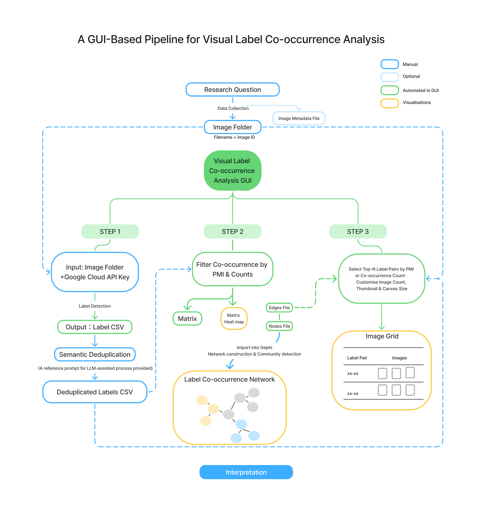
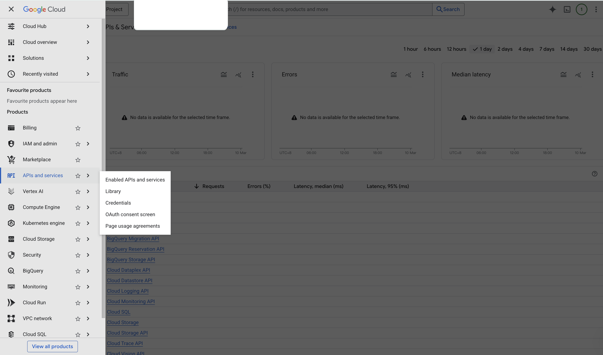
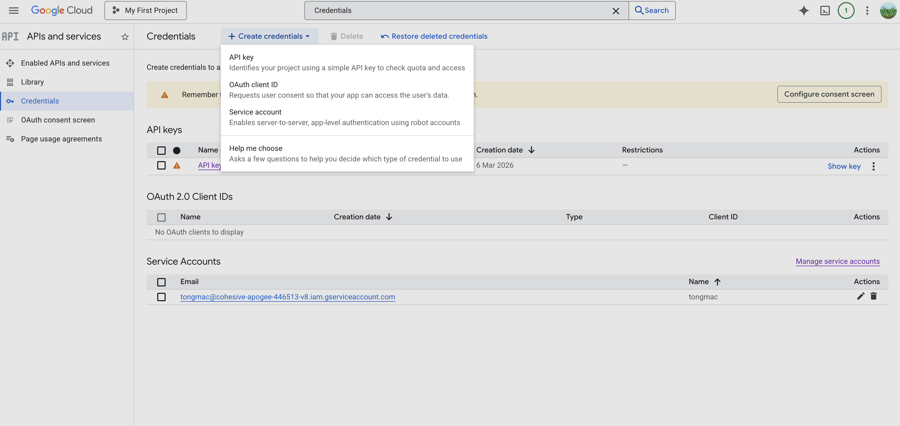
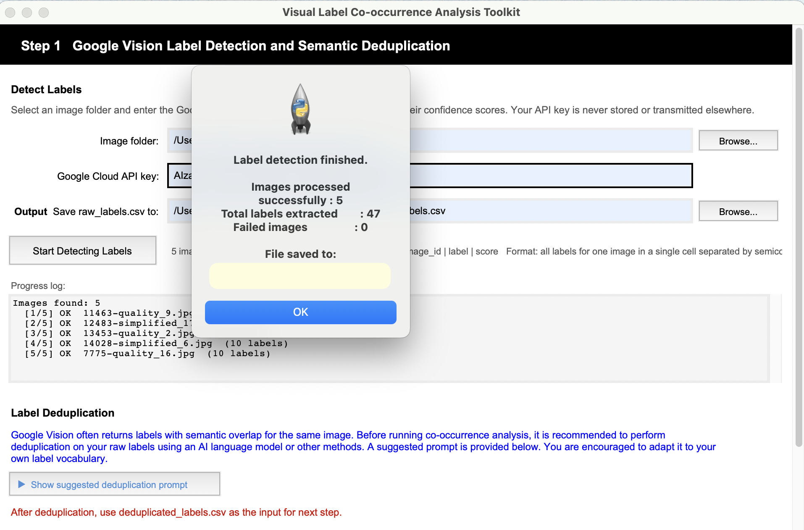
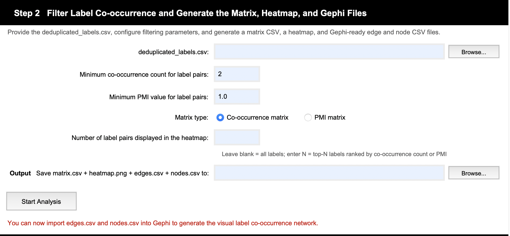
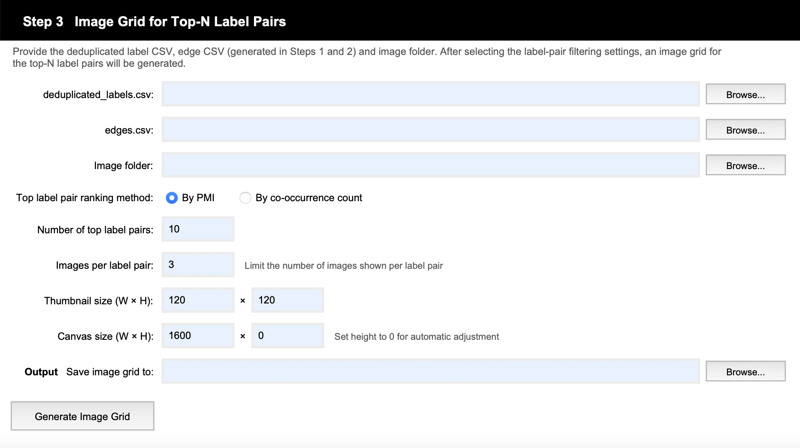

# Visual Label Co-occurrence Analysis Toolkit

A GUI-based pipeline for visual label co-occurrence analysis (VLCA) in image collections. It is designed for researchers in digital humanities, media studies, visual culture, and related fields who wish to investigate co-occurrence patterns among visual components without requiring programming experience.

The toolkit operationalises a reproducible three-step workflow that combines Google Vision label extraction and semantic deduplication, co-occurrence measurement and filtering, and multiple outputs for further visualisation including matrix heatmaps, network-ready files, and image grids. Rather than treating visual labels as isolated tags, VLCA treats them as machine-detected visual-semantic elements whose co-occurrence patterns can be analysed, visualised, and interpreted.

This project was developed as part of the author’s MA dissertation in Digital Humanities at King’s College London. For further theoretical background, please refer to the dissertation (access to be added after publication).


## Features

- GUI-based workflow with no programming required for end users
- Automated label extraction using Google Cloud Vision API
- Co-occurrence measurement using both co-occurrence counts and PMI
- Export of co-occurrence matrices and heatmaps
- Export of ready-to-use edge and node CSV files for Gephi
- Export of image grids for close reading of top-N label pairs
- Standalone application design for easier use and distribution


## Installation and Setup

### Option 1 — Run from Source

**Requirements:** Python 3.8 or above

**Step 1: Download the source file**

Download `vlca_gui.py` from this repository.

**Step 2: Install required libraries**

```bash
pip install requests pandas Pillow matplotlib seaborn
```

| Library | Purpose |
|---|---|
| `requests` | Sending images to Google Cloud Vision API |
| `pandas` | Reading and writing CSV files |
| `Pillow` | Image processing and grid generation |
| `matplotlib` + `seaborn` | Heatmap generation (Step 2) |

**Step 3: Run the application**

```bash
python vlca_gui.py
```

> **Note:** `tkinter` is included in most standard Python installations. If you encounter a `tkinter` not found error on Linux, run `sudo apt-get install python3-tk`.

---

### Option 2 — Download the Packaged Application

Pre-built standalone applications are available for download — no Python installation required.

| Platform | Download |
|---|---|
| Windows | [Download .exe](#) |
| macOS | [Download .app](#) |

> Replace the `#` links above with your actual release URLs once uploaded to GitHub Releases.


## Usage

The toolkit follows a three-step pipeline as illustrated in the diagram below.



---

### Step 1 — Label Detection and Semantic Deduplication

**Input:** An image folder (each image file must be named with its unique image ID) and a Google Cloud Vision API key.

> **Note:** This toolkit uses an API key rather than a Service Account credential file. Service Account keys have been found to be unstable for users who require a VPN to access Google services, making the simpler API key the more reliable option.

**How to obtain a Google Cloud Vision API key:**

1. Go to [Google Cloud Console](https://console.cloud.google.com/)
2. Navigate to **APIs & Services** → **Credentials** → **Create Credentials** → **API Key**




**Running Step 1:**

Select the image folder, enter the API key, and choose an output path. Click **Start Detecting Labels** to begin. Processing progress and the number of labels detected per image are displayed in the progress log. A confirmation pop-up appears when extraction is complete.



**Output:** `raw_labels.csv` saved to a user-defined path. Column format: `image_id | label | score`.

> **Note:** Users who have already obtained label data through other means can reformat their outputs to match this column structure and proceed directly to Step 2. Image IDs in the label CSV and filenames in the image folder must match exactly.

**Semantic Deduplication:**

Google Vision often returns semantically overlapping labels for the same image. It is recommended to perform semantic deduplication using an AI language model combined with manual review before proceeding. A suggested prompt is provided within the GUI interface. The deduplicated label CSV should be used as input for the subsequent steps.

---

### Step 2 — Co-occurrence Filtering, Matrix, Heatmap, and Gephi Files

**Input:** `deduplicated_labels.csv`

**Set parameters:**

- **Minimum co-occurrence count** and **minimum PMI value** for label pairs — default values are pre-filled in the GUI and can be adjusted
- **Matrix type** — choose between a co-occurrence matrix or a PMI matrix
- **Heatmap top-N** — specify the number of top label pairs to display in the heatmap, ranked in descending order by the selected metric

**Output:**

- Co-occurrence or PMI matrix (`.csv`)
- Matrix heatmap (`.png`)
- `nodes.csv` — contains each label and its frequency (can be used to set node size in Gephi)
- `edges.csv` — contains `Source`, `Target`, `Weight` (PMI value), and `cooccur_count`

Node and edge files can be imported directly into Gephi for network construction and community detection.



---

### Step 3 — Image Grid of Top-N Label Pairs

**Input:** `deduplicated_labels.csv`, `edges.csv`, and the image folder

**Set parameters:**

- **Top label pair ranking method** — rank by PMI or by co-occurrence count
- **Number of top label pairs** to display
- **Images per label pair** — maximum number of representative images shown per pair
- **Thumbnail size** and **canvas size** — default values are pre-filled and can be adjusted

The image grid enables close reading of the most prominent label pair associations across the dataset.




## Case Study and Example Outputs

The toolkit was tested using a publicly available dataset of AI-generated images from Hugging Face: [open-image-preferences-v1](https://huggingface.co/datasets/data-is-better-together/open-image-preferences-v1). The toolkit itself is not limited to AI-generated images and can be adapted to any image collection.

[插入你的输出成果截图或图片]


## Sample Data for Testing

To help new users get started quickly and reproduce results, a small set of test images from [open-image-preferences-v1](https://huggingface.co/datasets/data-is-better-together/open-image-preferences-v1) is included in this repository under the `sample_data/` folder.


## License

This project is licensed under the [MIT License](LICENSE).
